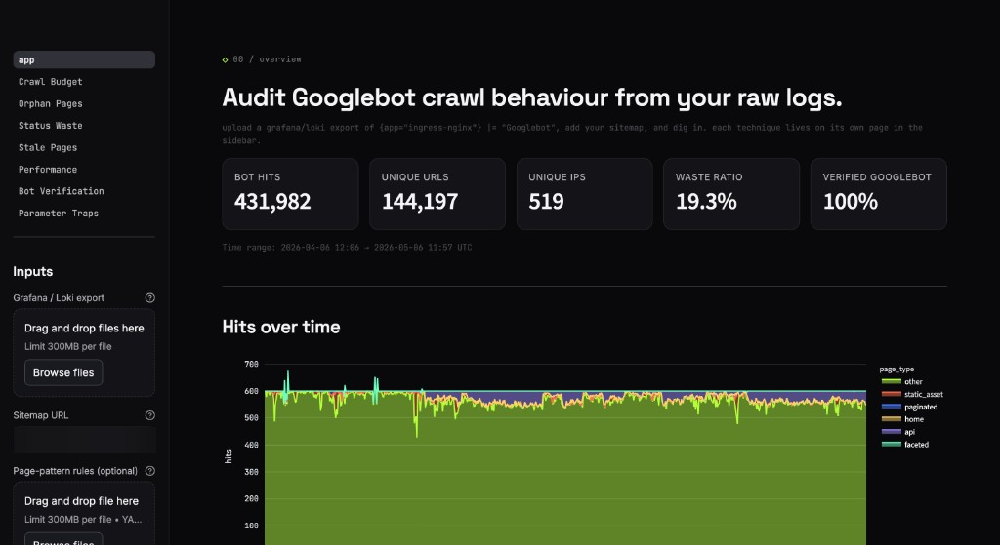
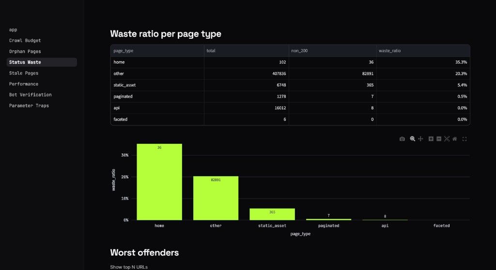
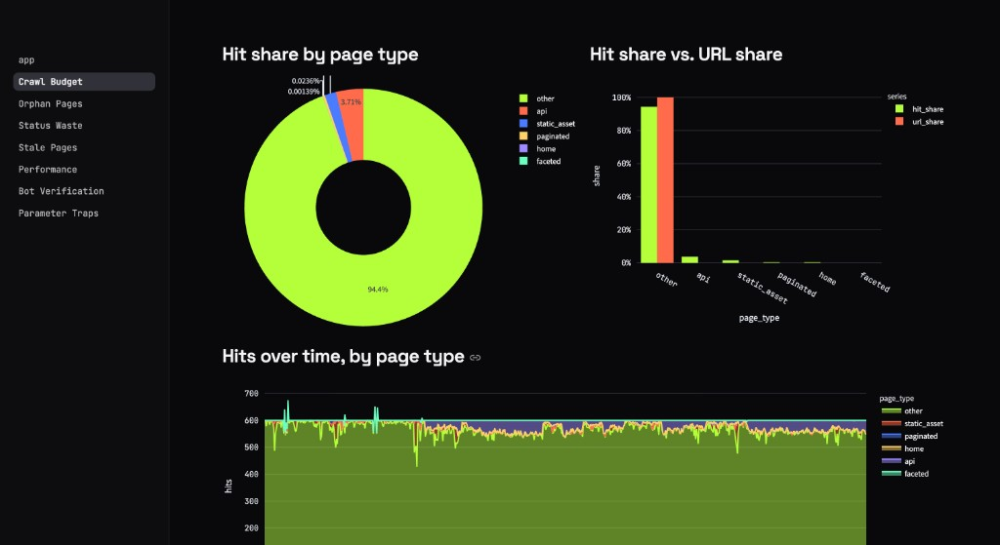
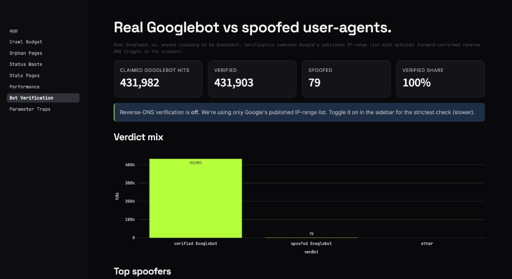
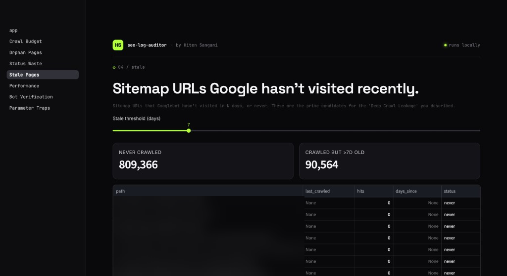
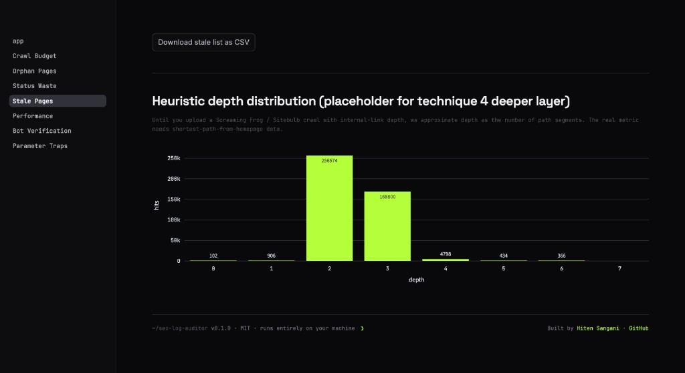

# seo-log-auditor

> Audit Googlebot crawl behaviour from raw nginx access logs. Runs entirely on your machine. No SaaS, no upload to a third party, no monthly cost.

[](https://pypi.org/project/seo-log-auditor/)
[](https://pypi.org/project/seo-log-auditor/)
[](LICENSE)
[](https://github.com/hitensangani/seo-log-auditor/actions/workflows/ci.yml)
[](https://github.com/rsen-pattern/log-file-analyser/stargazers)



Drop in a 7- to 30-day Grafana / Loki export of your nginx-ingress access logs, paste your sitemap URL, and get **seven concrete crawl-audit views** in under a minute. Built by an SEO engineer who got tired of paying €500+/month for log-analysis tools that ship the data offsite.

---

## Table of contents

- [How to use it](#how-to-use-it)
- [What to expect](#what-to-expect)
- [How to collaborate](#how-to-collaborate)
- [How to thank me / credit](#how-to-thank-me--credit)
- [Privacy](#privacy)
- [Develop locally](#develop-locally)
- [License](#license)

---

## How to use it

You need Python 3.9 or newer. Pick the install style that matches your setup.

### Option 1 — `uvx` (fastest, no install, recommended)

```bash
uvx seo-log-auditor
```

That's it. `uvx` downloads the package into a throwaway environment, runs it, and cleans up when you're done. Browser opens at <http://localhost:8501>.

> Don't have `uv` yet? Install once:
> - macOS / Linux: `curl -LsSf https://astral.sh/uv/install.sh | sh`
> - Windows: `irm https://astral.sh/uv/install.ps1 | iex`

### Option 2 — `pipx` (persistent install)

```bash
pipx install seo-log-auditor
seo-log-auditor
```

### Option 3 — Plain `pip` in a venv

```bash
python3 -m venv .venv
source .venv/bin/activate     # Windows: .venv\Scripts\activate
pip install seo-log-auditor
seo-log-auditor
```

### Option 4 — Double-click launcher (no terminal)

Grab `seo-log-auditor.command` (macOS) or `seo-log-auditor.bat` (Windows) from the [latest release](https://github.com/rsen-pattern/log-file-analyser/releases) and double-click. The script auto-installs `uv` if needed, then launches the app.

### Quick start (5 steps)

1. **Open the dashboard.** The sidebar has three inputs.
2. **Upload your log file** — a Grafana / Loki export of `{app="ingress-nginx"} |= "Googlebot"`. JSON, JSONL, NDJSON, CSV, or plain nginx text — auto-detected.
3. **Paste your sitemap URL** (a sitemap-index works too).
4. *(Optional)* Run `seo-log-auditor init-config` in a terminal to drop a starter `page_patterns.yaml` next to you. Edit it for your URL structure, then upload it via the third sidebar field.
5. Click **Load / refresh**. Wait ~15–30 seconds for a 30-day file. Browse the seven analysis tabs in the sidebar.

### Exporting logs from Grafana

In Grafana Explore against your Loki datasource:

```
{app="ingress-nginx"} |= "Googlebot"
```

Set time range to **last 30 days** (or however far back you have retention) and download as **JSON** (richest fidelity), JSONL, CSV, or plain text. All four are auto-detected by the parser.

---

## What to expect

Seven analyses, one per sidebar page. Each answers a specific question that should drive a specific action.

| # | Page | Question it answers |
|---|---|---|
| 1 | **Crawl Budget** | Where is Googlebot spending hits, vs. where do your URLs actually live? A large positive delta = over-crawled page type. Large negative = neglected. |
| 2 | **Orphan Pages** | Which URLs is Googlebot hitting that aren't in your sitemap? Often old marketing landing pages or deleted sections still earning backlinks. |
| 3 | **Status Waste** | What share of crawl traffic hits 3xx / 4xx / 5xx, broken down by page type? Where is your crawl budget being burned on errors? |
| 4 | **Stale Pages** | Which sitemap URLs hasn't Google visited in N days? Prime candidates for the "deep crawl leakage" problem. |
| 5 | **Performance** | How does page size and latency correlate with crawl frequency? Find the size-based inflection point where Google starts skipping pages. |
| 6 | **Bot Verification** | Real Googlebot (verified by Google's published IP ranges or rDNS) vs. spoofed user-agents. |
| 7 | **Parameter Traps** | Paths whose query strings explode into hundreds of unique variants — faceted nav, session IDs, tracking params, sort orders. |

### Screenshots

<details>
<summary><strong>Crawl Budget — where the hits actually go</strong></summary>


</details>

<details>
<summary><strong>Status Waste — what share of crawl is wasted</strong></summary>


</details>

<details>
<summary><strong>Bot Verification — real Googlebot vs spoofed</strong></summary>


</details>

<details>
<summary><strong>Performance — size vs hit-frequency deciles</strong></summary>


</details>

<details>
<summary><strong>Stale Pages — sitemap URLs Google ignores</strong></summary>


</details>

### Realistic timing on real data

| Log file size | Rows | Parse + enrich time |
|---|---|---|
| ~50 MB / 7 days | ~100k rows | 2–5 seconds |
| ~200 MB / 30 days | ~430k rows | 15–30 seconds |
| ~500 MB / 30 days (busy site) | ~1M rows | 60–90 seconds |

After the first parse, results are cached in session — switching between the seven tabs is instant.

---

## How to collaborate

This is my first public open-source project. I want it to be useful to other SEO engineers and SREs, and the fastest way to get there is more eyes and more contributors.

### Easiest ways to help (in increasing order of effort)

1. **Star the repo** if you find the idea useful. It's the single highest-signal thing you can do — it tells me to keep investing time.
2. **Try it on your own logs and open an issue** describing what worked, what broke, what was confusing. Specific data > generic feedback.
3. **Suggest a feature** via [GitHub Issues](https://github.com/rsen-pattern/log-file-analyser/issues/new/choose). The roadmap below is just my opinion — yours is probably better.
4. **Send a pull request.** See [CONTRIBUTING.md](CONTRIBUTING.md) for how the codebase is structured and what "good" looks like.
5. **Write about it.** A blog post, LinkedIn post, conference lightning talk, internal tool round-up — credit appreciated, see below.

### What I'd love help with first

- **More log formats.** The parser handles Loki/Grafana exports and raw nginx today. PRs welcome for: Cloudflare logs, AWS ALB / CloudFront logs, Apache combined-log, Caddy.
- **Better page-type starter rules.** The bundled `page_patterns.example.yaml` is opinionated. PRs that add starter configs for Shopify, Webflow, WordPress, headless e-commerce, etc. would help every new user.
- **A demo mode** (`seo-log-auditor demo`) that loads bundled synthetic data so people can poke around without their own logs. Listed in the roadmap.
- **Internal-link-depth correlation** — this needs a Screaming Frog / Sitebulb export importer to ship.

### Roadmap (v0.2+)

See [CHANGELOG.md](CHANGELOG.md) for the full list. Headlines:

- Bundled demo dataset + `--demo` flag
- Direct Loki API streaming (skip the file-download step)
- SQLite cache for week-over-week comparison
- Internal-link-depth via Screaming Frog / Sitebulb import
- Cloudflare / ALB / CloudFront log support
- Optional headless mode that emits an HTML report instead of running a server

### Reporting security issues

Please don't open public issues for security problems. See [SECURITY.md](SECURITY.md) for responsible-disclosure instructions.

---

## How to thank me / credit

If this saved you money, time, or a meeting where someone asked "how is our crawl budget being spent?" — here's how to show appreciation. None of these are required, all are appreciated.

### Free, takes 5 seconds

- [](https://github.com/rsen-pattern/log-file-analyser) **Star the repo.** GitHub stars are how this surfaces in trending lists, awesome-lists, and search.
- **Fork it.** Even if you don't plan to contribute, forks signal real-world use.
- **Follow on GitHub** → [@rsen-pattern](https://github.com/rsen-pattern)

### When you write or talk about it

If you mention `seo-log-auditor` in a blog post, talk, tweet, LinkedIn post, internal write-up, or newsletter, please credit:

> Built by **Rahul Sengupta · Pattern** ([pattern.com](https://pattern.com)) — open-source on GitHub at [rsen-pattern/log-file-analyser](https://github.com/rsen-pattern/log-file-analyser).

A link back to this repo and to [pattern.com](https://pattern.com) is the kindest thing you can do. Tag us on LinkedIn / X if you'd like a thank-you reply.

### If your team adopts it at work

If `seo-log-auditor` ends up part of your team's regular workflow, we'd genuinely love to hear about it — drop a note via the [Discussions tab](https://github.com/rsen-pattern/log-file-analyser/discussions) or via [pattern.com](https://pattern.com). Real-world deployment stories shape what comes next.

### About

Maintained by Rahul Sengupta at Pattern.

→ [pattern.com](https://pattern.com) · [GitHub](https://github.com/rsen-pattern)

---

## Privacy

**Your logs never leave your machine.** This is a deliberate design choice — production access logs contain URLs, IPs, and behavioural data that should not be uploaded to a third party.

The app makes only these network calls:

- Fetching your sitemap (you provide the URL)
- Fetching Google's published [crawler IP ranges](https://developers.google.com/search/apis/ipranges/googlebot.json)
- Optional reverse-DNS lookups to verify Googlebot IPs (you toggle this in the sidebar)

No telemetry, no analytics, no usage tracking. Streamlit's own usage stats are disabled by the launcher.

The `page_patterns.yaml` config you upload, the parsed log DataFrame, and the sitemap fetch result all live in Streamlit session state on your machine and are wiped when you close the tab.

---

## Configuration: `page_patterns.yaml`

The classifier is driven by a YAML file mapping URL regexes to page types. The first matching pattern wins. Drop a starter file:

```bash
seo-log-auditor init-config
```

Edit it to match your URL structure, then upload it via the **Page-pattern rules** field in the sidebar. Tagging pagination, faceted-filter, and tracking-beacon paths as their own page types makes crawl-budget leakage immediately visible on the Crawl Budget page.

---

## Develop locally

<details>
<summary>Click to expand</summary>

```bash
git clone https://github.com/rsen-pattern/log-file-analyser.git
cd seo-log-auditor
python3 -m venv .venv
source .venv/bin/activate
pip install -e ".[dev]"
pytest
seo-log-auditor
```

The Streamlit app entry point is `src/seo_log_auditor/_app/app.py`. Multipage discovery picks up `src/seo_log_auditor/_app/pages/*.py` automatically. The seven analysis modules live in `src/seo_log_auditor/analysis/`.

See [CONTRIBUTING.md](CONTRIBUTING.md) for the codebase tour and PR guidelines.

</details>

---

## License

[MIT](LICENSE) — use it, fork it, ship it commercially. Attribution appreciated but not required.
